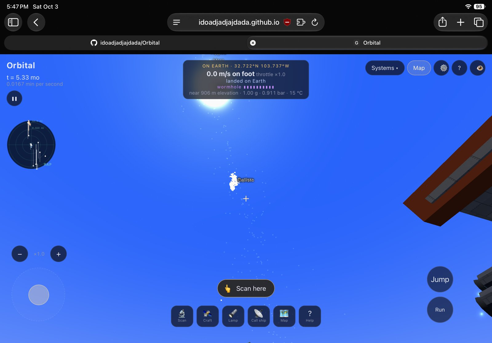
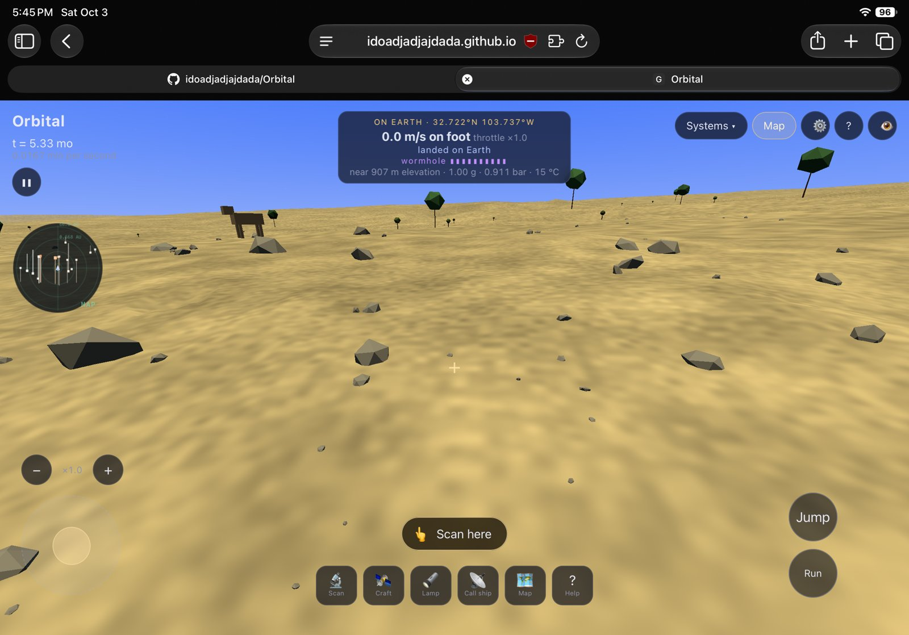
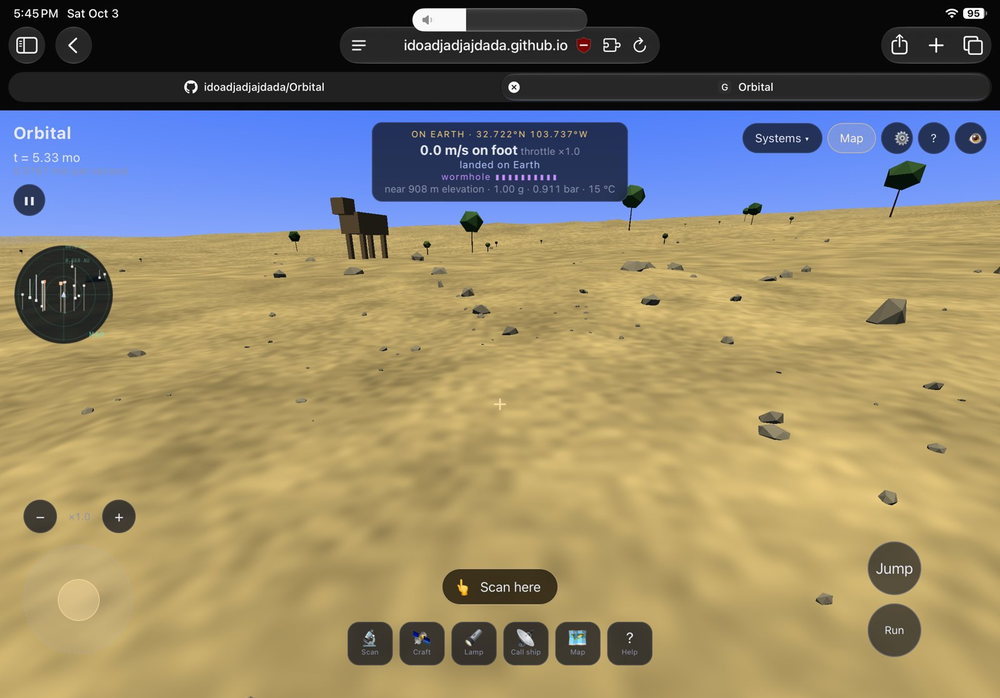

# Feedback, 3 October 2026

Earlier rounds of this day (the ship, landing, Lander 1, Mars, the Sun, black holes) were asked before notes were kept; their original wording wasn't saved. What was built from them is in [Built](../Built.md). The reference pictures from those rounds are in [References](../References.md).

## Looking from the ground: the sky, the rocks, structures, pads

> The Kepler belt is for some reason visible from earth, aswell as like moons. And I also did 2 photos almost right next to each other, you can tell the rock formations are different on both for some reason. Instead premade terrain is better I would say, also structures sometimes are floating or in the ground, make sure they have variable height so none of them are underground or anything. Actually also add the ability to place where you want the base, or where you want to shoot something into space. Have launch pads that you need before actually sending things into space. Add the orbit lamp to the Mission Control things with all the other crafts, and the new launchpad, the launchpad works with a lander, allowing for travel back and forth.

What was done:
- The belt and moons fade out in daylight (89055af)
- Rocks and the ground fixed to the world, the same from any distance (347f546, 89055af)
- Structures settle onto the ground at their lowest point (89055af)
- Choose where a base or launch pad goes; launch pads needed to launch from the ground; the orbital lamp in Mission Control; Lander 1 between pads and the ship (1b0e78f)
