# Feedback, 4 October 2026

Each message as sent, then what was done.

## Better models for the bases and trees; monitors
Sent with the base and tree model packs.

> Continue. Also I have some better models for trees and also the bases, make sure the bases are actually useful and stuff. In the areas with monitors allow you go to Mission Control, or leave a monitor on a specific craft's camera, so you can view it even if you aren't focused on the computer. Make sure it's not always rendering or playing because that will cause lag, incorporate a system to keep lag low as possible. For the trees, you can resize them and stuff for even more variance (even though there already are multiple different types already)

Done: walk-in bases from the models, consoles as monitors with craft cameras (drawn only near and facing, a few times a second), modelled trees sized and varied per tree (2365ddd).

## Grass and a growing area in the bases

> Add procedural grass texture and small models of grass. Make the like planet area in the bases for testing composition and growing plants in different soil-like substances for growing plants possibly.

Done: grass texture and tufts; the growth lab in each base's dome (62d728a).

## Ruins and rockets
Sent with the ruins and rocket model packs.

> Here are ruins that can be scattered VERY INFREQUENTLY, on different planets, they are recolorable to fix on different terrain. Then there’s actual modular rockets that can be used to send people, cargo, etc. this works with launchpads and land pads.

Done: rare ruins tinted to the ground; the Courier, Wayfarer and Mammoth flying crew, supplies and rovers between pads, bases and stations (4d8f3ac).

## Commit to main

> Oh well it should’ve been on main??? I want it always committed to main, and if you can just delete all other branches that are behind or the same.

Done: everything goes to `main` now (and `CLAUDE.md` says so for every session). Deleting branches was blocked by the session's permissions:
- **Safe to delete** (nothing that isn't on `main`): `ship-drive`, `v2-rewrite`, `claude/inspiring-shannon-163bib`
- **Have their own commits:** `landing`, `more-landing`, `backup/parallel-landing-claude`, `wip-ship-interior`

## Notes in Obsidian, kept by Claude

> Honestly then should we set up a thing where you could see them? Without any pc? Then like bugs I describe are written to the notes, features, reference photos, original messages for context, etc. and I can easily access it

Done: this notebook. Messages are kept word for word here, photos in `attachments/`, bugs and features filed in [Bugs](../Bugs.md) and [Roadmap](../Roadmap.md), and `CLAUDE.md` makes every session keep it up.

## The brief for agents, and a better way to read and edit the notes

> Make sure to describe in the readme to direct agents to the notes, and then give them a brief that they too should add bugs, reference photos, yada yada, to my notes. This will create a nice workflow. Though GitHub’s app is kinda horrible for notes, is there any way you can make a nice interface that works without you writing it in, but allows me to make direct changes.

Done:
- The README sends agents to `AGENTS.md` and the notes. `AGENTS.md` is the brief: keep your messages word for word, file bugs, features and reference pictures, add the bugs and references they find themselves, and log what they build. `CLAUDE.md` points to it.
- The notes app at https://idoadjadjajdada.github.io/Orbital/notes/: read with photos, tick, edit, and add a bug, feature, idea or reference with photos, each saved straight to `main`.
- Pushes that only change `notes/` no longer run the five-minute test and deploy.

## A red mark on GitHub

> Can you give it a lil logo so when I add it as a web app on my home screen it look better?

Done: a gold ringed planet and its moon, as the home-screen icon, the tab's icon and the app's home button (70d2d96).

> The first of the two commits failed

It hadn't failed: its run was cancelled when the next commit was pushed two minutes later, with every job that had finished passing. Done: on `main` a run now finishes rather than being cancelled by the next push, so every commit gets its own pass or fail (e207bb0).

## Feature: Add interior to orbiting stations.
Added in the notes app.

> Add interior to orbiting stations.

Done: every station already had an inside (the ISS's layout: its modules, the Cupola, the galley and the labs), but the way in was hidden. Now each station in Mission Control's fleet list has **Dock**, which flies the ship over and docks, then **Go aboard** (62bddbc). Still also in by spacewalk to its Kibo airlock, or by riding a rocket to it.

## Feature: Better textures in general and specifically on the land of planets and things.
Added in the notes app.

> Better textures in general and specifically on the land of planets and things.

Done for the land (fa4f147, cfea32a, 4d02d5c). Near you, the ground is now lit pixel by pixel over a relief of grit, stones and hummocks, so the light picks them out, and it shows what it is made of:
- **Steep or rough ground:** bare rock in strata, with cracks.
- **Loose ground:** stones and pebbles.
- **Mars and Titan:** wind ripples in the sand.
- **Ice worlds:** long cracks, and glints where the sun catches a facet.
- **Io and Venus:** dark lava rock pitted with gas bubbles.

It fades out with distance, so it costs nothing further off. Textures seen from orbit are still to do (in the [Roadmap](../Roadmap.md)).

The Moon, the same spot before and after:
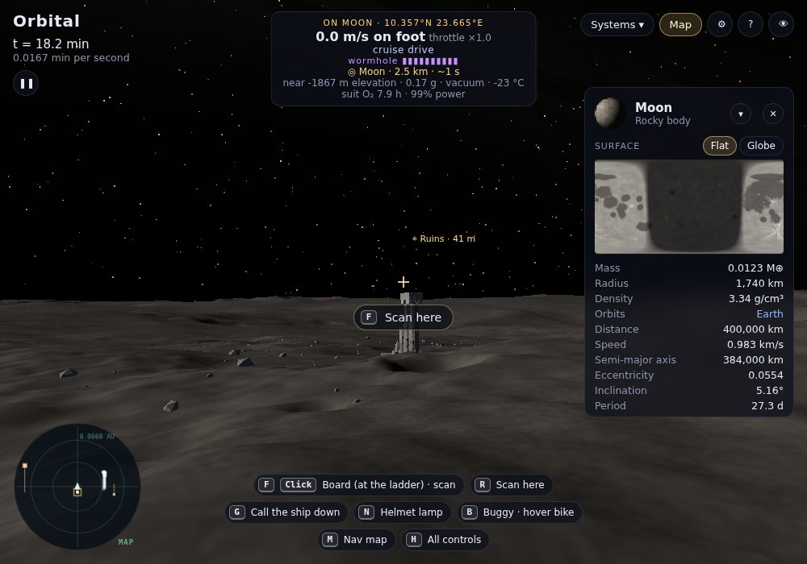
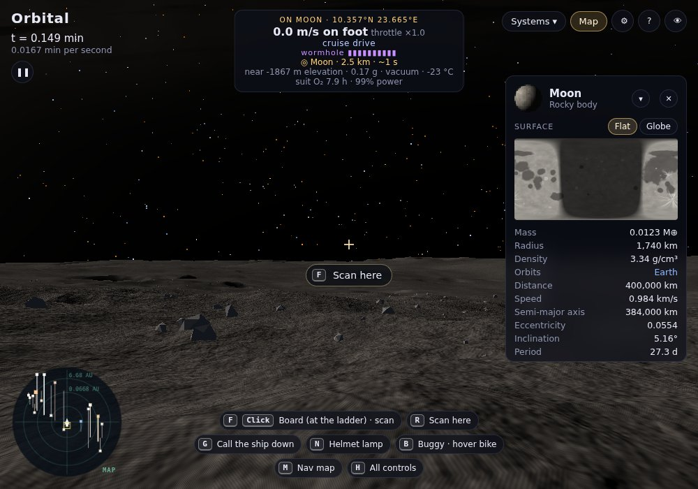
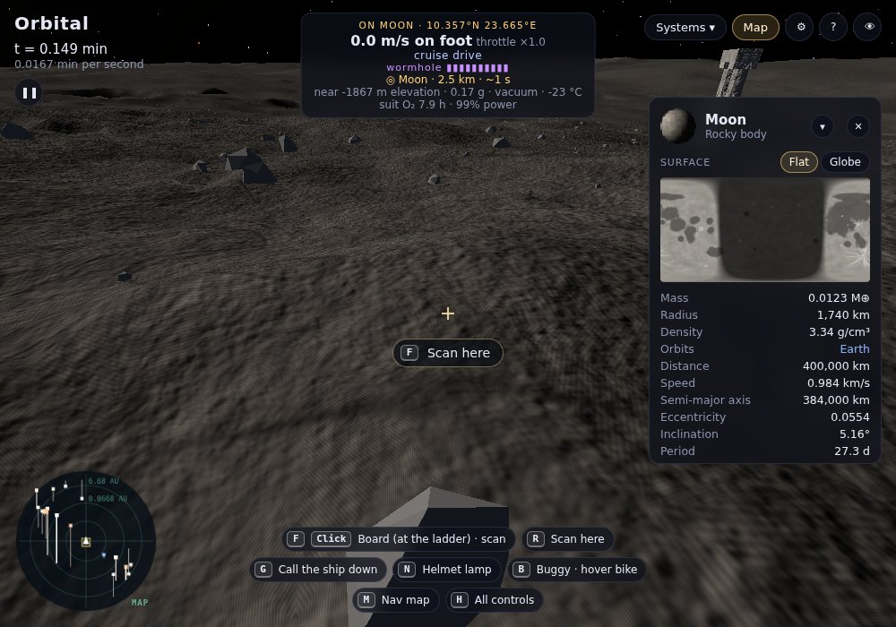

Mars, before and after:
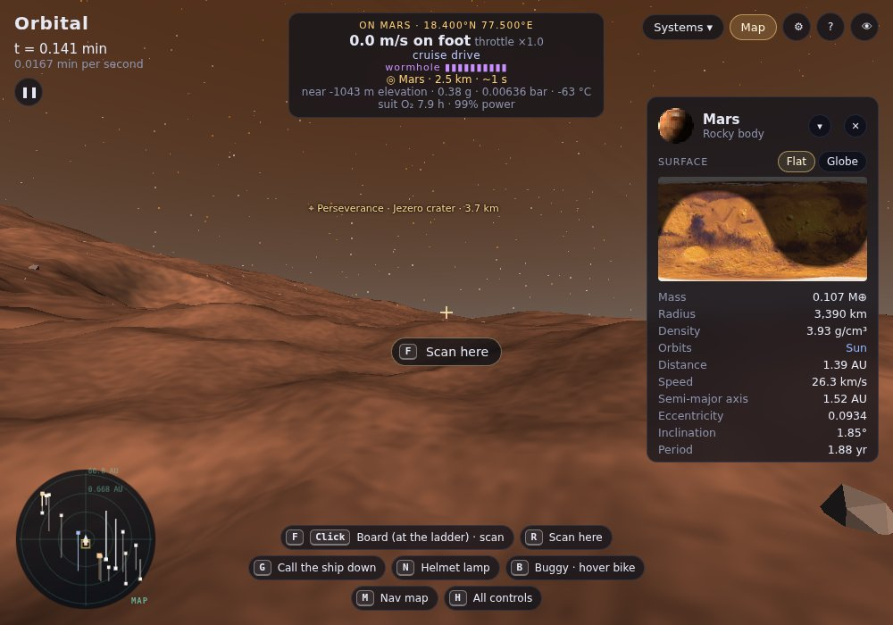
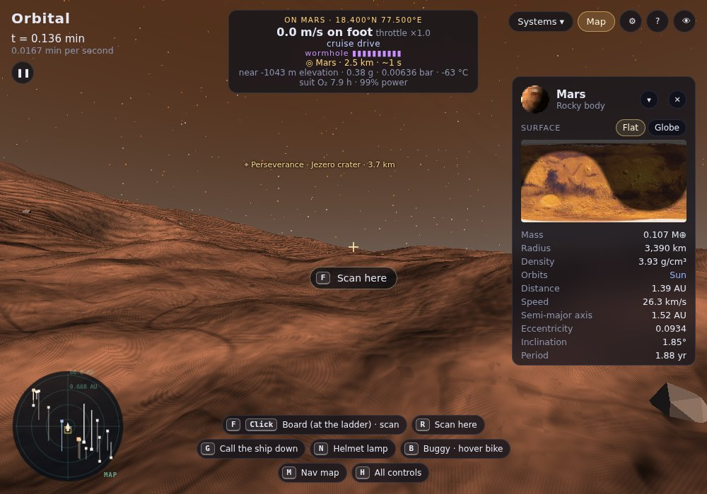

Europa's cracked ice:
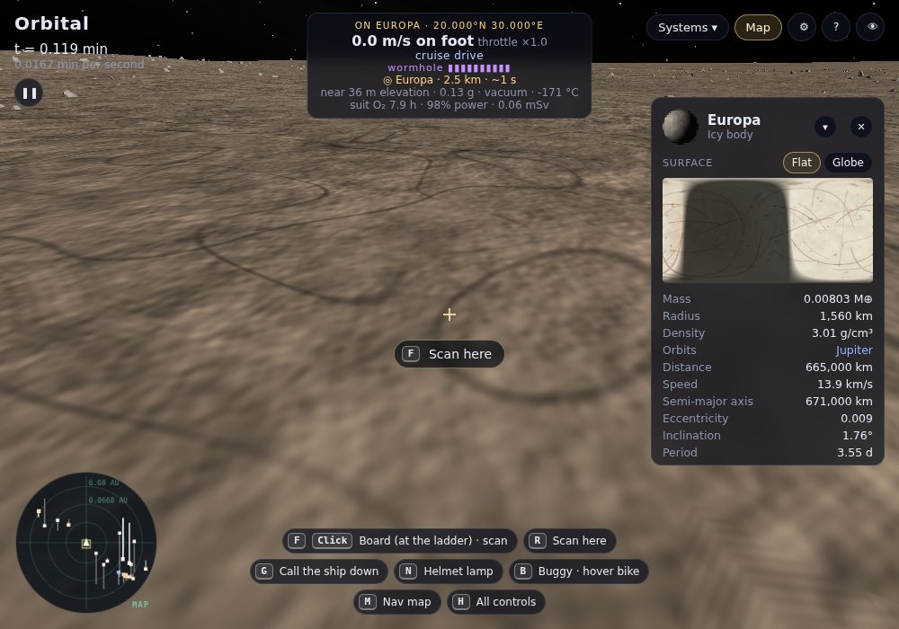

## Check for bugs, then the roadmap

> Alright I got it set. Check for any bugs, if none continue roadmap.

No bugs filed, CI green, tests pass. Looked over the ground on several worlds (for bugs, and as the "before" for better textures), then on to the roadmap: your two items first.

## Committed and deployed?

> Are all changes committed and deployed?

All committed to `main`. Not all deployed: the last two runs (4d02d5c and 5b131fc) failed, so the site was still the one from cdd5b30, without the new ground. The cause: the ground's new close-up relief made each frame heavy enough on CI's software renderer that Lander 1's descent ran past its two-minute test limit.

Done: the close-up ground now costs no more than the ground before it, and the site is deployed with it (9ea26d0).

## Gravity, the ship's looks, and the map
No files came with it.

> There’s a pretty large bug, and I had just noticed what it is. The space craft and even me are not affected by gravity, so when we try to land, the earth keeps moving from underneath us, when it should be stable. Make the ship look better, outside and inside.
> Transitioning from 3D to the map, breaks the game and causes my 3d rendered view to be stuck in place, and to just see labels of where the planets and stuff would be during map mode, so fix that, and also just call it 2d and 3d.

Done:
- **Gravity:** the ground was sliding because the ship stayed still while the world turned under it (465 m/s at the Earth's equator). Near a world, the ship, Lander 1 and you in the suit now turn with it, so the ground holds still under you. Low over the ground, you sink toward it in the suit (09cc9fd).
- **3D to 2D:** the 3D picture stayed on screen, frozen, over the 2D view. Now it goes, and the button reads **2D** or **3D** (09cc9fd).
- **The ship's looks (6039531):**
  - **Outside:** the plates are painted and bare metal that catch the light, with their seams and rivets in relief, and the belly is darker. White strobes flash on the fin, the belly and the chin, and the roofs carry vents, boxes and conduits.
  - **Inside:** each wall has a kick plate with a line of guide light along the floor, a rail at waist height, ribs at its ends and a cove of light under the ceiling. The nav table is dark glass with a lit rim.
  - **Fixed on the way:** the dorsal spine had been built upside down, hanging into the aft passage and engineering. It now stands on the roof, and the tail fins no longer dip into engineering.

The commons before and after:
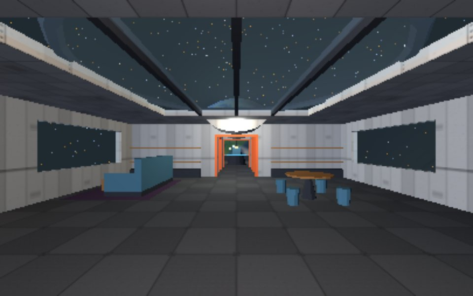
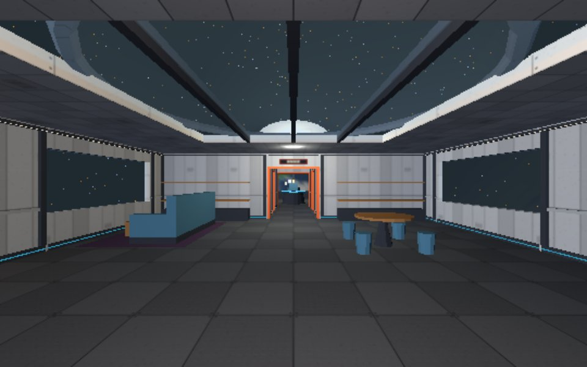

Outside:
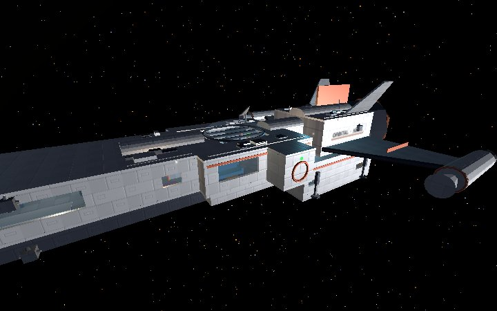
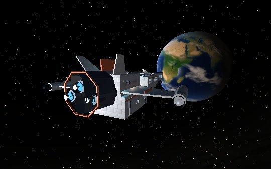

## Bug: "caves" arent really caves, they're above ground structures with a tunnel. There
Added in the notes app.

> "caves" arent really caves, they're above ground structures with a tunnel. There should be cave networks that are actually underground and render as apart of the land, not a seperate thing.

Done (c23f94b). Caves are now under the ground.
- **The way in:** a ramp cut down into the land. The land itself is cut away there, and trees and grass keep out of the cut. It goes into the hill, the way that gets under the land soonest.
- **Inside:** a winding passage with chambers along it, side passages, and one going down a level. Every passage has several metres of rock over its roof, and no floor is steeper than you can walk.
- **The rock** is one surface, like the land, so the passages open into each other with no seams. Stalactites hang in the chambers of limestone and ice caves.
- **Walking:** you walk down the ramp onto the cave's floor, and its walls stop you. You can't step off the edge of the cut. Walking on the land over a passage, you stay on the land.
- **Light:** the daylight fades as you go in; your helmet lamp (N) shows the way.
- **Lava tubes** (the Moon's maria, and lava worlds) are tubes about 15 m across, reached down the rubble where the roof fell in. There are two within 500 m of Tranquility Base.

On the Earth (a limestone cave at 50.0°N 15.0°E): the mouth in a forest, looking out from inside, and a chamber by lamplight:
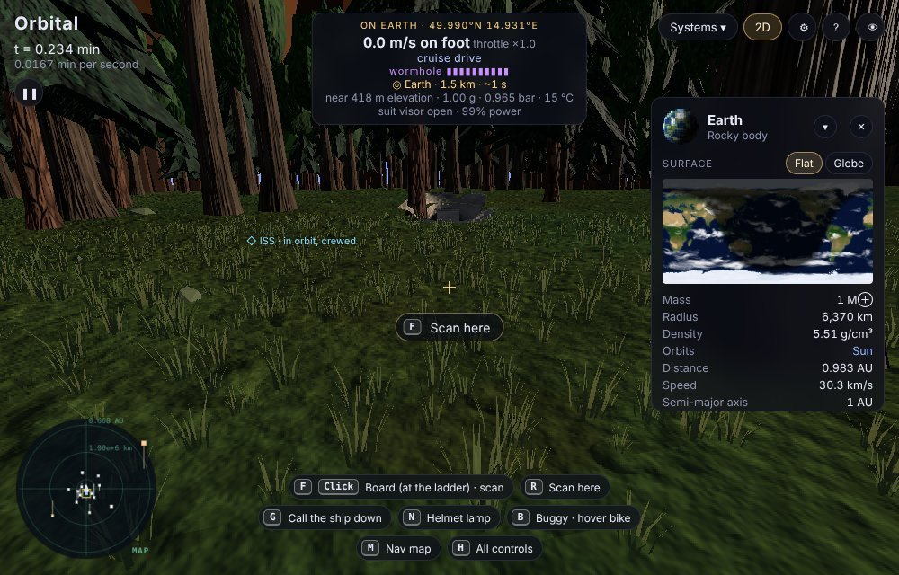
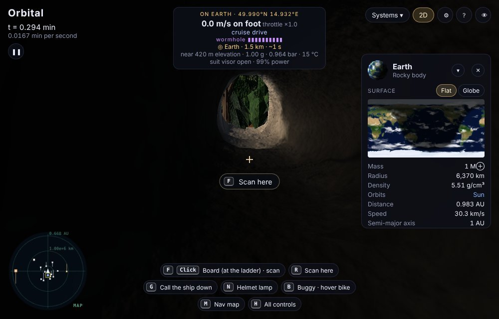
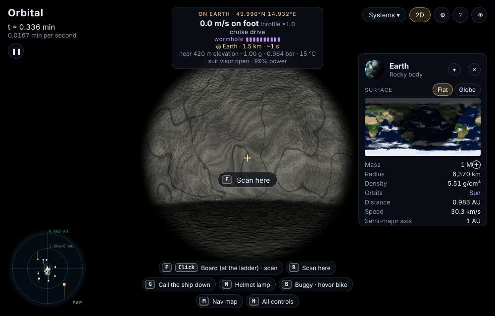

On the Moon, a lava tube near Tranquility Base: the pit from above, the tube by lamplight, and looking out at the stars:
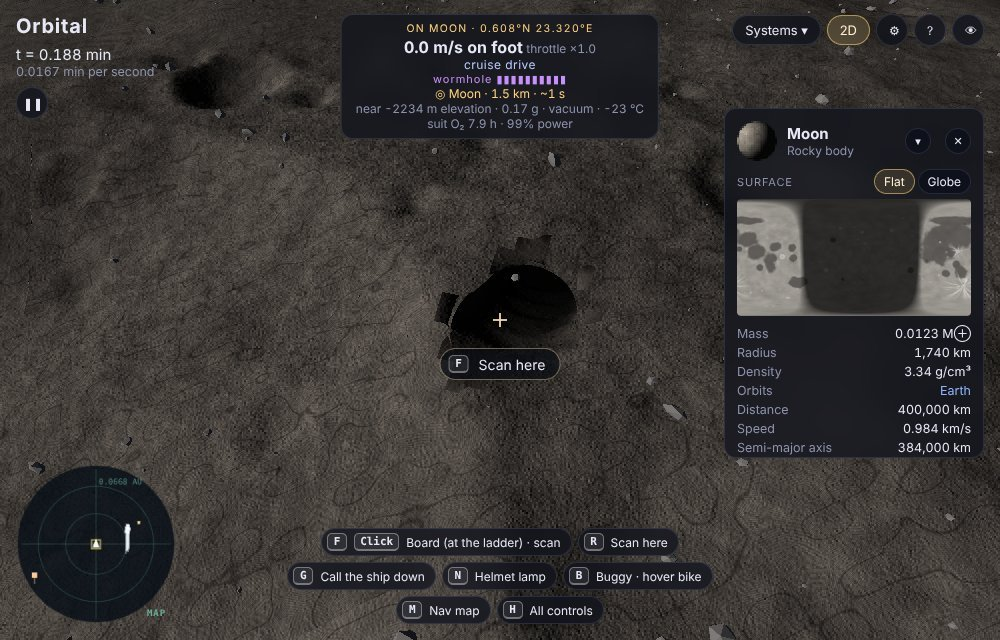
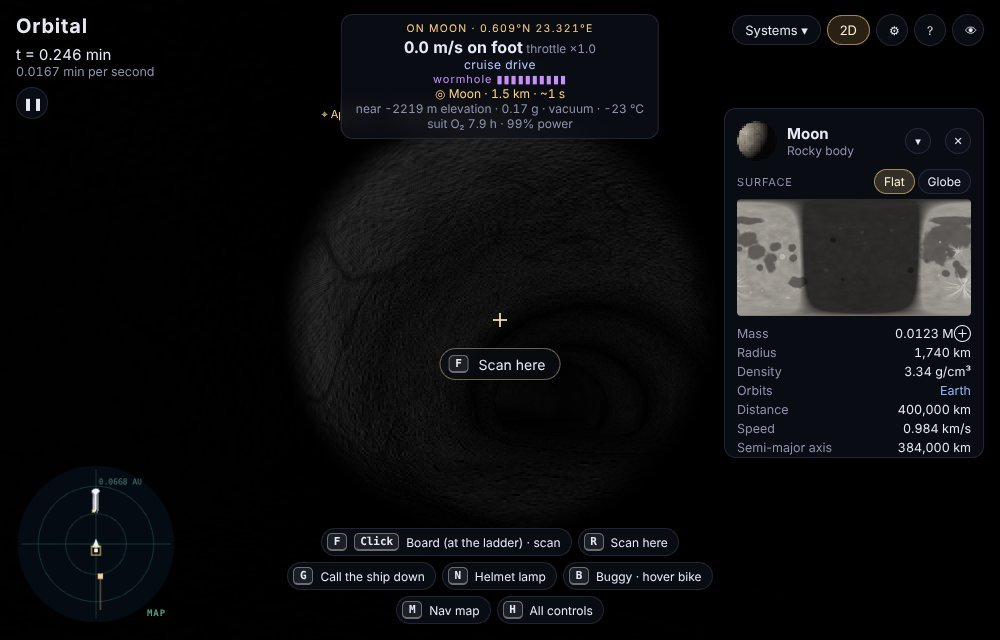
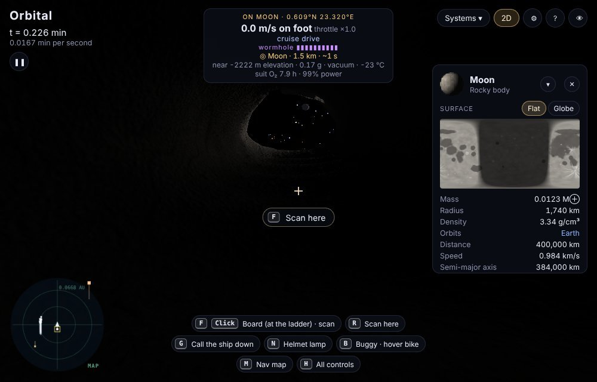
