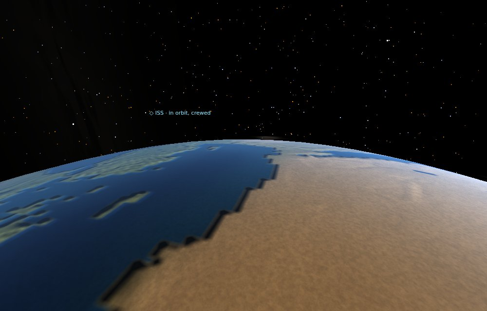
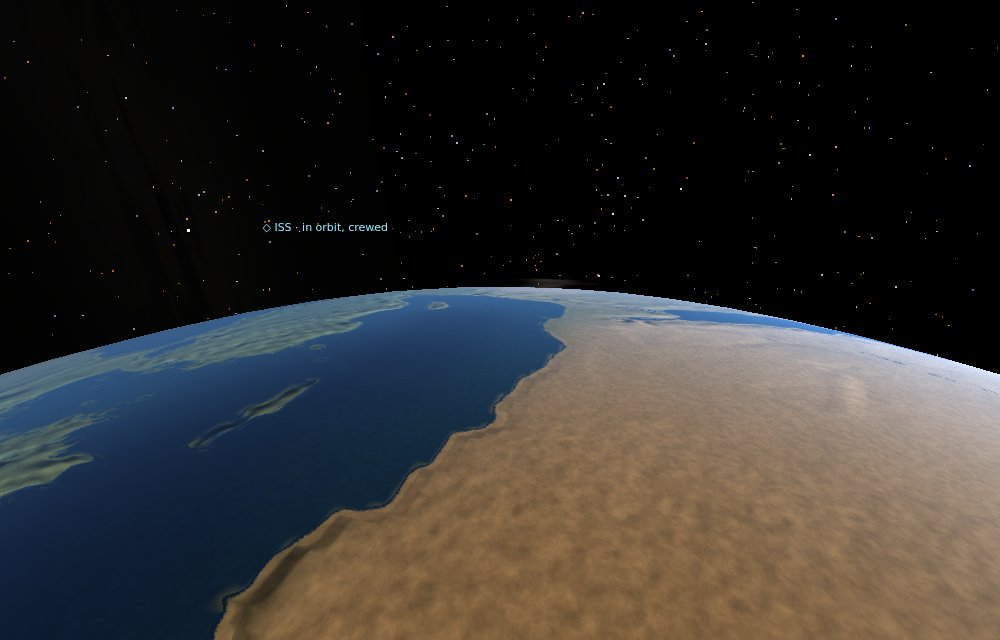
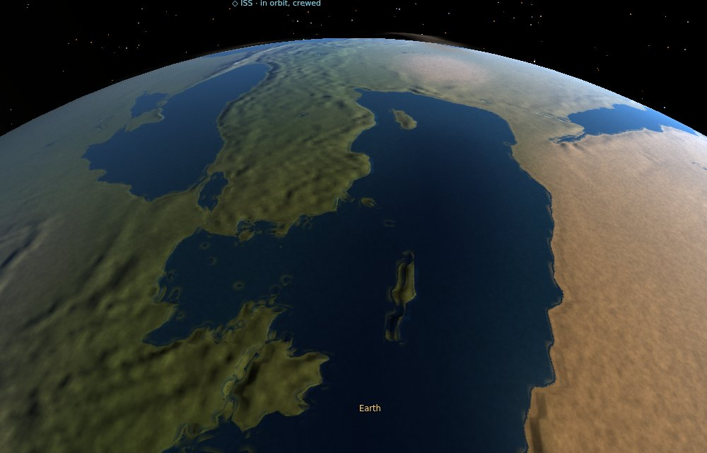
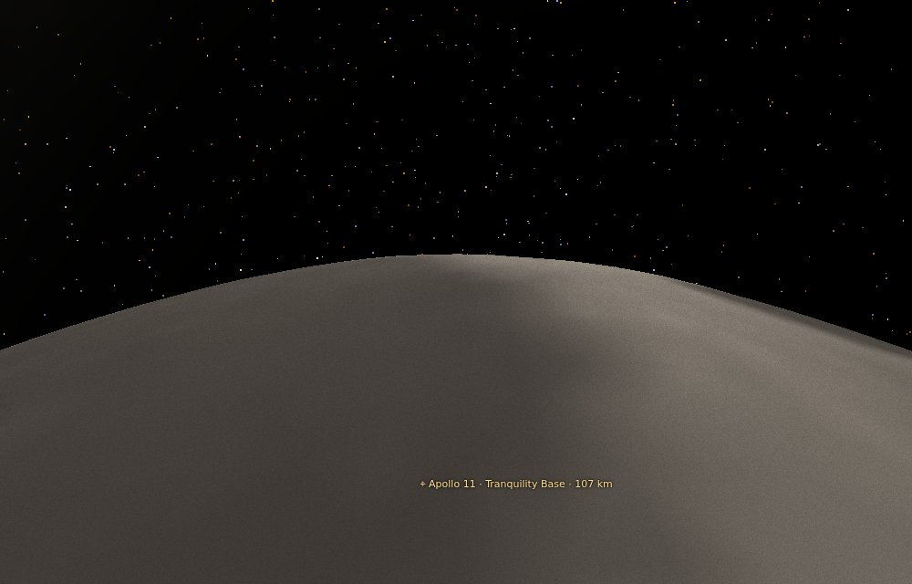
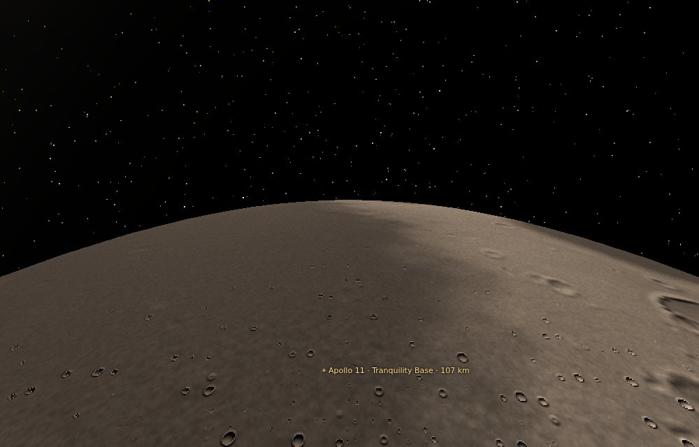
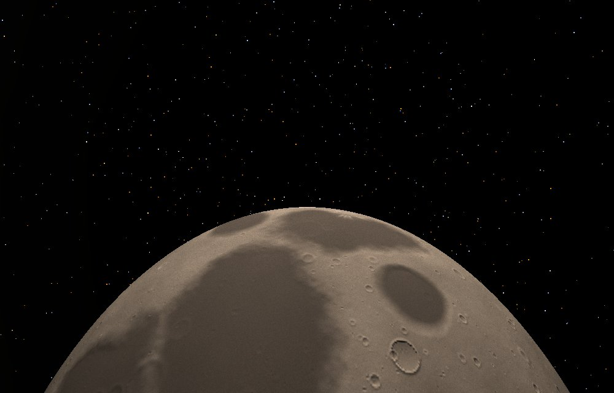
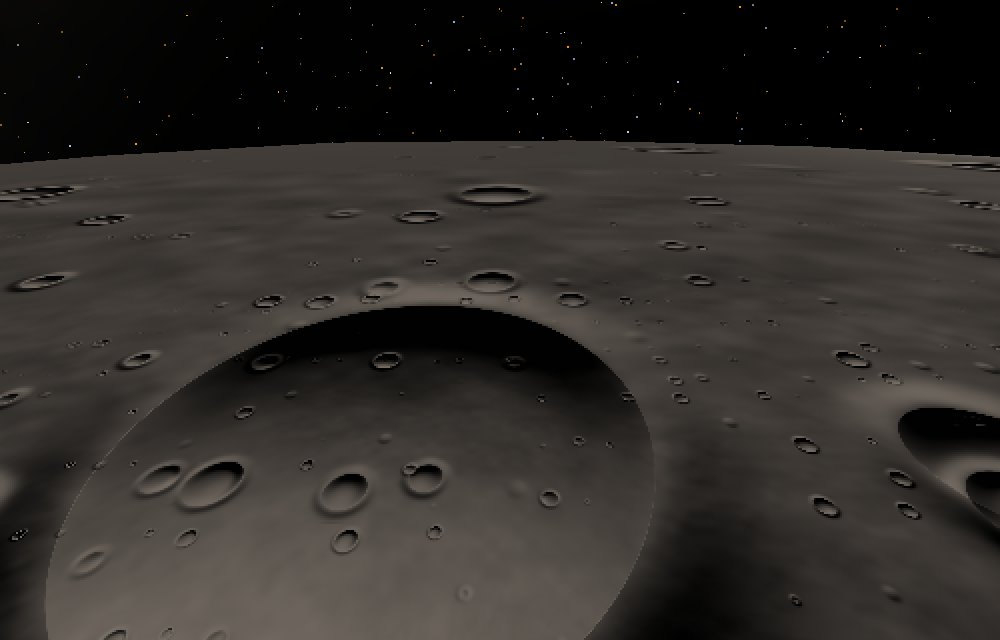
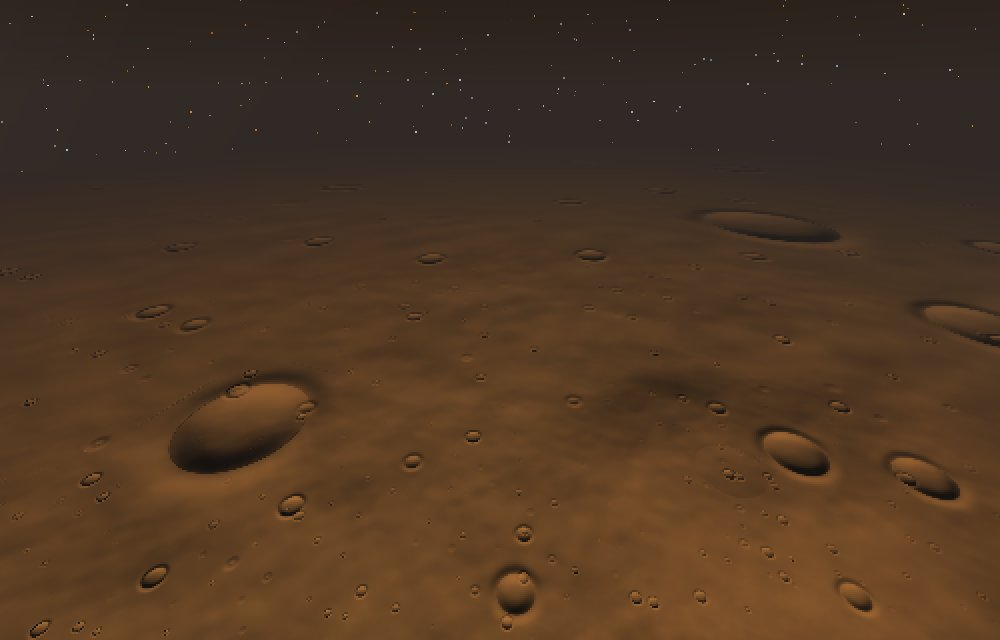

# Feedback, 5 October 2026

## Docking: the station flies away
No files came with it.

> When attempting to dock the station, the station just keeps flying away. Fix tbat

Done (21c210e). The station goes round the Earth at 7.7 km/s, and Dock flew the ship toward where the station *was*, at a speed set by the gap. So the ship trailed it by about nine kilometres and never reached the port.
- **Dock:** now allows for the station's own speed and catches it up. From 8,000 km away it docks in about twenty seconds.
- **Flying up by hand:** within 10 km of a station, the ship goes round with it, so the station holds still in front of you. Press F at **Dock with ISS**.

## Textures from orbit, and the ship's model to download
No files came with it.

> Do the second part of better textures, and give me the my ship’s 3d model in a downloadable format.

Done.

**The ship's model (c310445):** on the site at https://idoadjadjajdada.github.io/Orbital/ship/, with a picture.
- On an iPhone, **View in AR** opens it in Quick Look, and you can set it down in the room.
- There are also the files: **USDZ** (Apple's format) and **GLB** (glTF, for Blender and most 3D apps).
- It's the ship as the game builds it: outside, and every room inside.
- When the ship changes, `node tools/export-ship.mjs` makes them again.

**Textures from orbit and from the air (32e87c0, 63f1c84):**
- **Coasts:** the Earth's coasts were staircases of 39 km blocks. They now come from coastline data four times finer (about 10 km), so Sicily, the Greek islands, Crete, Cyprus and the Red Sea show. Close to the Earth the shore is drawn sharper than the map itself. Canaveral Base moved a few kilometres north to stay on dry land.
- **Detail close to a world:** finer than its map, with hills and hollows, and craters where a world keeps them. The Moon and other airless worlds are cratered at every size, Mars somewhat; the Earth, Venus, Titan and Io have none.
- **From the air:** a couple of kilometres up and higher, the ground has relief and craters from kilometres down to tens of metres, where before it was one flat colour.
- **Cost:** frames from the air and from orbit are within a few percent of before.

The Earth from 400 km, before and after:

The Moon from 150 km, before and after, and from 1,000 km:

From the air: the Moon from 5 km (a crater forty kilometres across, with smaller ones in it), and Mars from 20 km:

