# Feedback, 6 October 2026

## The new ship (v2)
Came with a 3D model of the ship, `orbital-ship-v2.glb` (5.6 MB). It's kept as `tools/data/models/orbital-ship.glb`.

> There’s been multiple new changes. I want to also add in this new ship to replace the current one. Reread the GitHub page and read me stuff

Done (d4a9b6a). The game's ship is now your v2, outside and in.

**What the model is:** the ship from the download page, reworked:
- **Outside:** a new swept hull, white with orange stripes, a longer nose, a framed canopy, three nozzles at the back, and slimmer pods at the wingtips. The old hull was cut away where the new one covers it.
- **Inside:** furniture in every room: chairs on the bridge, armchairs, a coffee table, plants and full shelves in the commons, a kitchen island with stools, a runway down the passages, new suits in the airlock and the hangar.
- **New textures** on the walls, floors, ceilings and plates.

**How it's in the game:** the game still builds its own ship for the rooms, the stations, the screens, the reactor, the lander and the legs, so all of those still work. On top of that it loads your model:
- your hull goes on, and the old pieces you removed are hidden: the orange trim, the nozzles, the skylight dome, the dish and the engine cowling;
- the engine flames moved to your nozzles;
- your furniture is solid: you walk round it, not through it;
- your textures replace the old plating.

**Changed so it still works:**
- **Coffee and the galley:** your kitchen island stands in front of them, so you can now use them from across the island.
- **Engineering:** a pipe across the floor behind the reactor would have shut you out of the power console. Anything under 45 cm is stepped over, so it no longer does.
- Every station is still reachable on foot from the airlock.

**The download page** (https://idoadjadjajdada.github.io/Orbital/ship/) has the new ship too: GLB 5.7 MB, USDZ 12 MB.

Outside, and the cockpit:
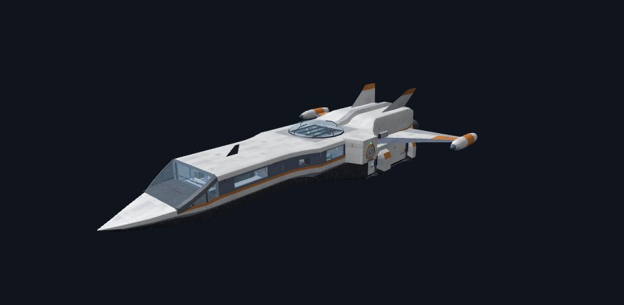
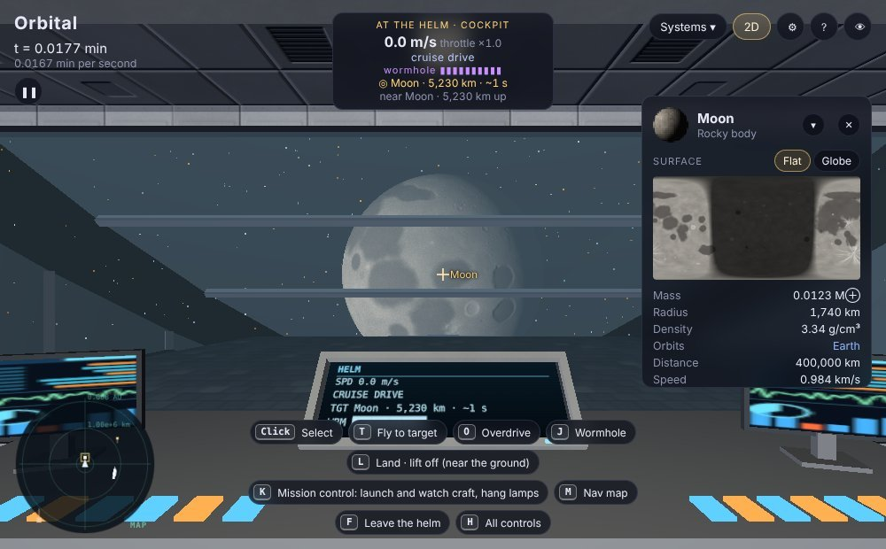

The commons, the galley and the bridge:
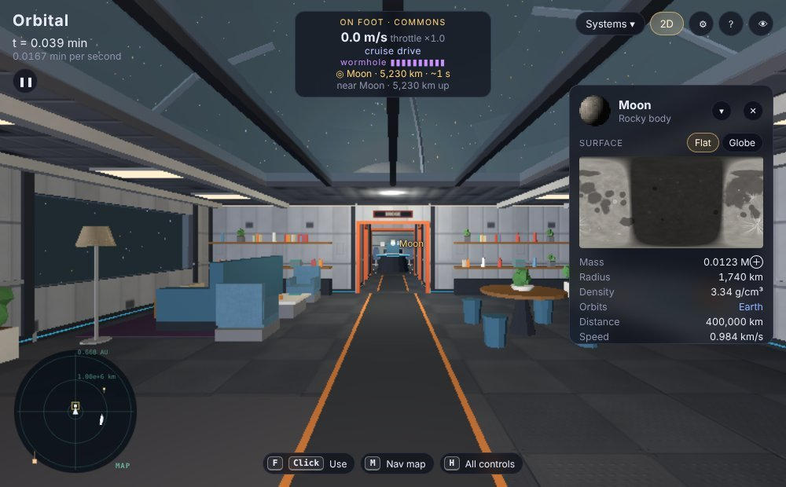
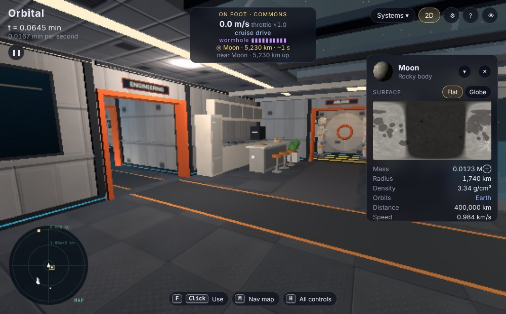
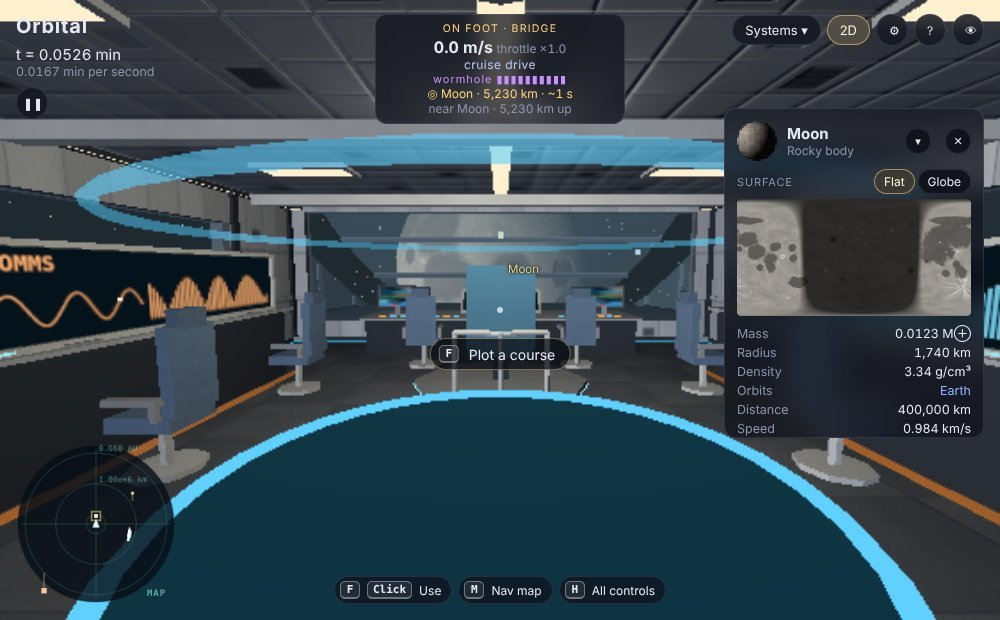

## Work through the bugs, then the roadmap
No files came with it.

> Okay go ahead and start with the bugs/features on notes then do the rest of the roadmap

So far:
- **The bug:** caves are now underground networks (c23f94b): see the [bug's entry](2026-10-04.md#bug-caves-arent-really-caves-theyre-above-ground-structures-with-a-tunnel-there).
- **Rockets (5bfbad1):**
  - Their doors and hatches open as you walk up and shut for flight.
  - Riding one, you sit in the cockpit, or in the Wayfarer's cabin with the passengers; Z goes between those and the view outside.
  - **Fly back** takes a rocket to where it came from.
  - **Run** puts it on a supply route: out with its load, back empty, again and again until you press Stop.
- **Bases and stations (5bfbad1):**
  - Their crews eat into their stores, a day a minute of your time (not while paused, and not when you speed the clock up or sleep).
  - **Stores low:** a warning.
  - **Out of stores:** emergency rations. After ten days of those, the crew leaves.
  - **Loading at a base** takes from its stores; spaceports never run out.
  - **Where to see it:** a base's page in Mission Control shows its crew and how many minutes its stores last.

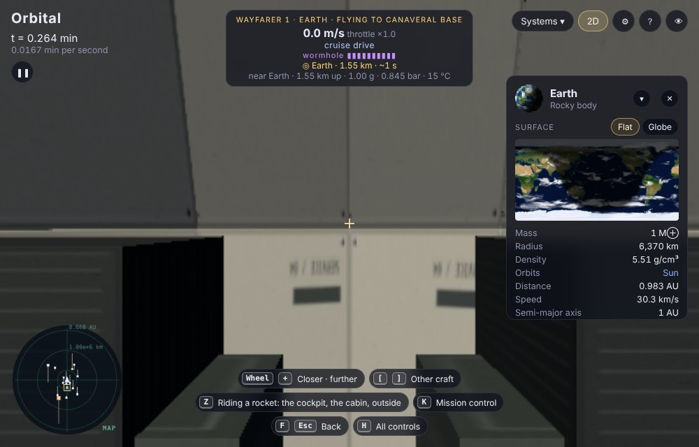
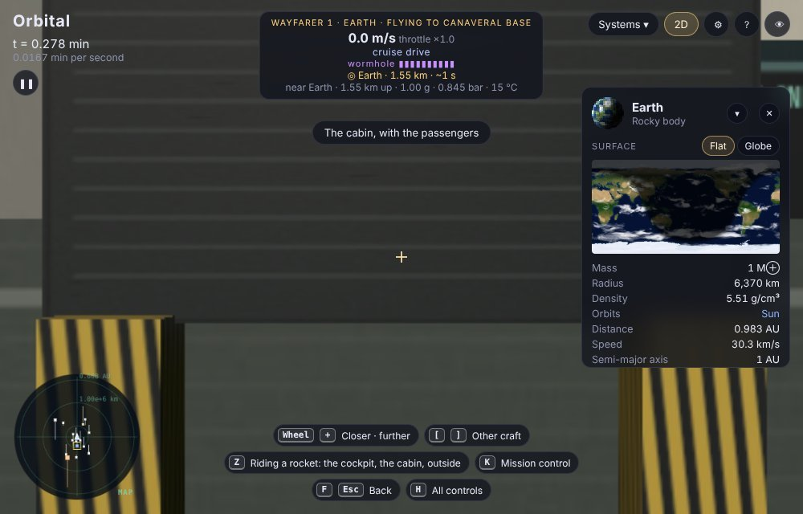
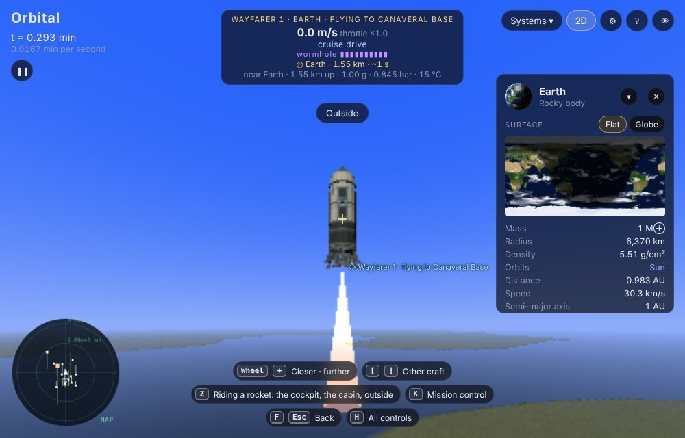
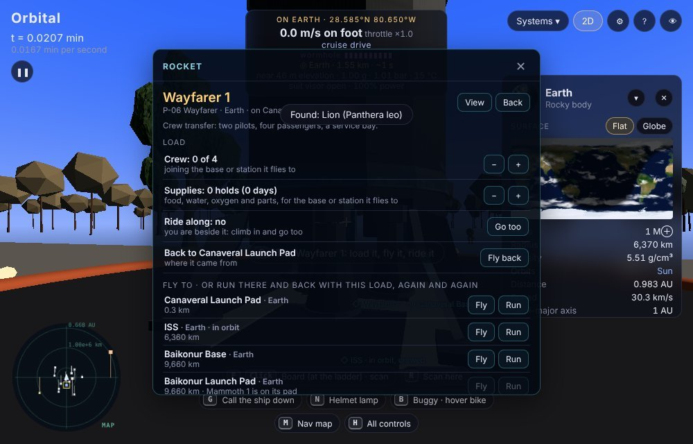
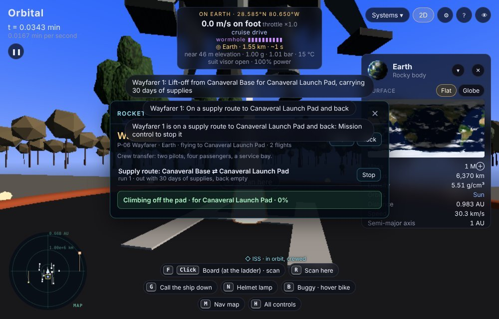
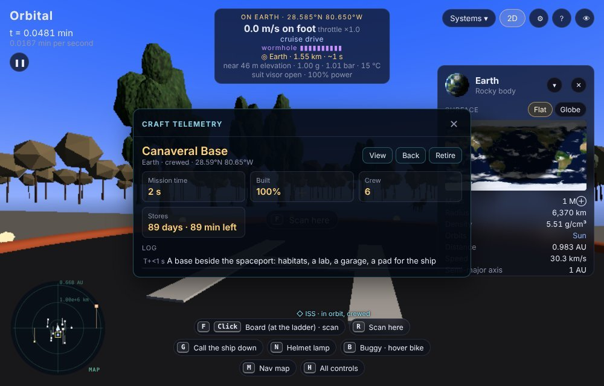
