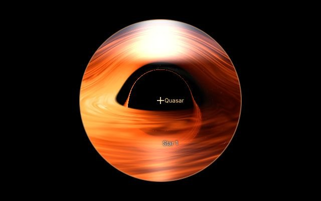
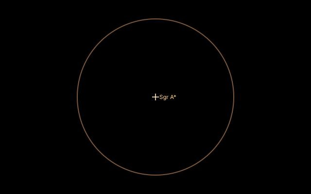
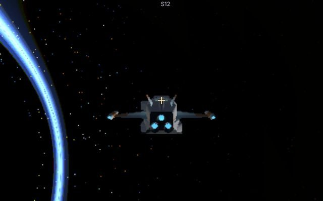
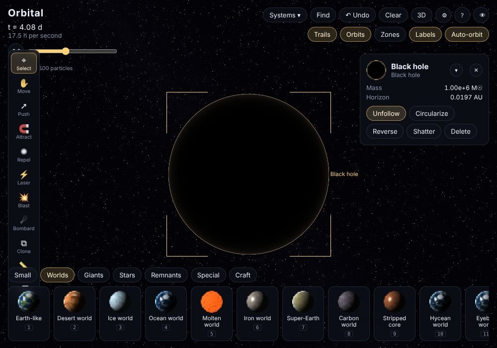
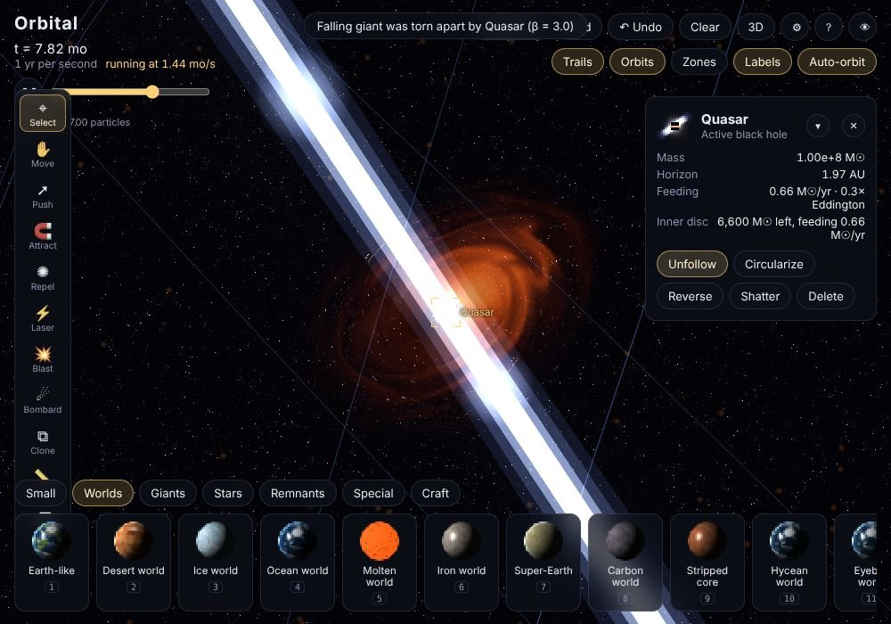
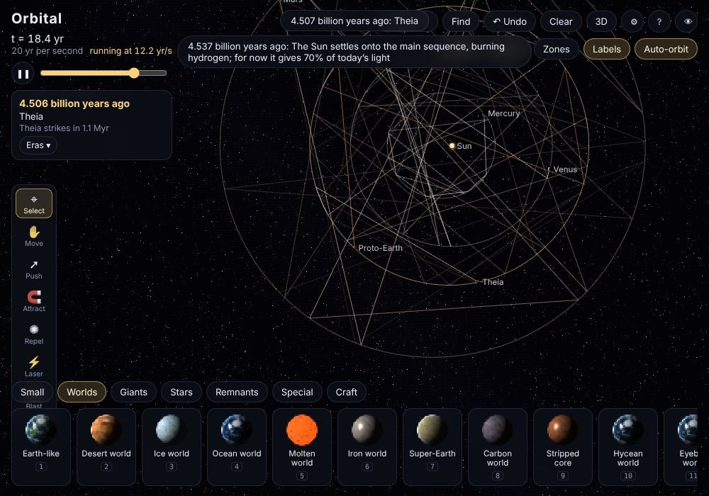
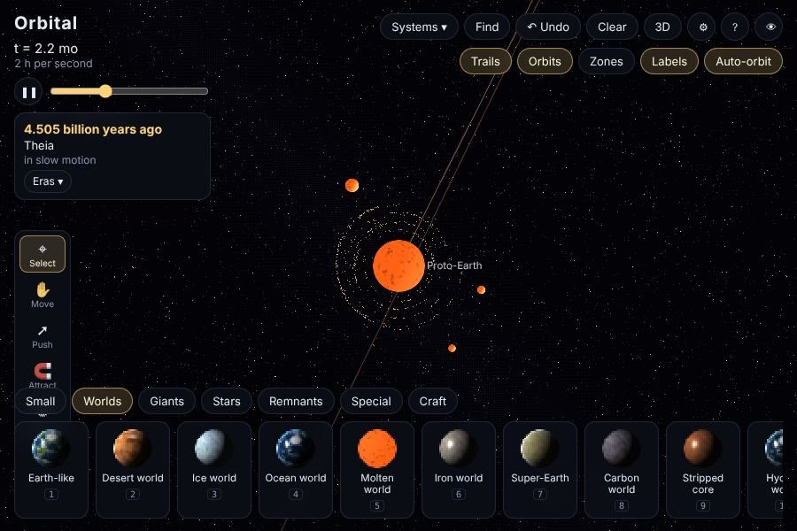
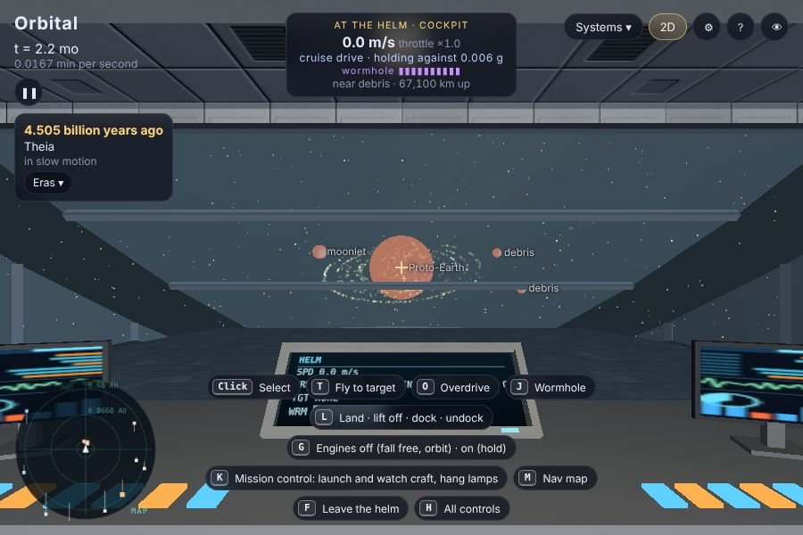
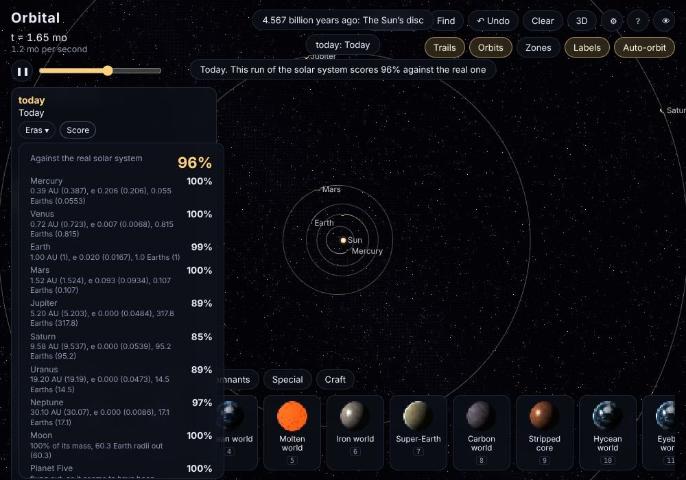

# Feedback, 7 October 2026

## Controls, gravity, the black hole, and an early solar system
No files came with it.

> There are some control overlaps, docking and leaving the helm are the same key, which makes it impossible to actually enter any orbiting station. It also still seems that me and my ships gravity aren’t quite right yet, and aren’t fully being counted. The black hole ring look ridiculous from 2d, and could be slightly improved in 3d, and enabling the ability to fall into the black hole, nothing happens once you go to like the singularity but your view gets changed accordingly to realistic simulations. Also add a brand new early solar system preset, the planets are in their early developments and we even had a few extra planets and objects, try not to do too many but include enough to be accurate allow it to go through all the regular processes we believe were required to form our current solar system and planets, score its accuracy. Load in objects as they become important, especially objects that were flung into our solar system that caused things to happen, and let each planet go through its actual process and it should come out looking pretty much like our solar system, and you can fast track to any era of the solar system, and it has accurate high quality textures. Things like major impacts will happen over time and natural forming of the solar system. We would be seeing the extra gas planet, theia, and more. Obviously over time, theia gets flung into earth and makes it go all fluid and ends up creating a ring and a moon, with some extra debris that eventually just falls back down to earth, the extra gas giant gets flung out like we simulate, etc.

So far:
- **Docking (0892313):** L docks and undocks (the prompt already showed L); F only ever leaves the helm, so once docked you get up and walk to the airlock. On a controller X, on touch the 🛬 button.
- **Gravity (0892313):**
  - The ship had none: it hovered wherever you let go. Now every body pulls on it. With the engines on (as at start) they hold it against the pull, and the readout says what they're holding against ("holding against 1.00 g").
  - **G** (or the 🪂 button) turns the engines off: it falls, or goes round in orbit, and the stick pushes it. G again holds it.
  - On a spacewalk every body pulls you, not just the ground under you; by a station you fall with it.
  - Landed, the ship's decks have the world's gravity (a sixth of a g on the Moon), not a g.
  - The readout's gravity is the gravity at your height.
- **Black holes (972e662):**
  - **Falling in:** through the horizon there's no way back. The fall to the singularity takes as long as it really would in your own time (microseconds for a stellar hole, shown slowed; minutes for a quasar, shown faster). At the singularity the equations stop, and the game puts you back outside.
  - **What you see** is traced from your own frame: hold still near it with the engines and the shadow swells to fill nearly the sky; fall freely and it shrinks, the sky round it turning blue; inside the horizon, light from below is dark and the sky narrows to a band.
  - **The disc** winds into spiral streaks, without the moiré rings, in 3D and on the map.
  - **On the map** a bare hole's edge is a faint glow, not an orange outline.

- **Early solar system (215bac4):** in **Systems**, *Early solar system*. A panel under the clock shows how long ago it is, the era and what comes next; **Eras** jumps to any era.
  - **Two clocks:** the orbits run at their real speed; the system's age runs as fast as each era needs (a few hundred years a second in the disc, tens of millions later). Impacts slow right down so you can watch them.
  - **The eras:** the Sun's disc (a young Sun in gas and dust, Jupiter's core pulling in gas); Jupiter's Grand Tack (in to 1.5 AU and back out, which is why Mars is small); giant impacts (embryos crash into the proto-Venus and proto-Earth, a hit-and-run strips Mercury's mantle, a blow over its pole knocks Uranus onto its side); Theia; the giants' instability; the late heavy bombardment (Hellas, Caloris, Imbrium); oceans and first life; oxygen and snowball Earths; animals and plants (Chicxulub included); today.
  - **Theia** grows at the Earth's Lagrange point, then strikes it. The Earth melts, a ring of debris forms, a Moon gathers in it within days, and the rest falls back. The Moon then spirals out on the tides and the Earth's day lengthens to pay for it, from about five hours to 24.
  - **Planet Five**, the fifth giant, is in the chain with the other four. When the chain breaks, a close pass by Jupiter throws it out of the solar system, and Jupiter jumps inward. Uranus and Neptune are carried out to where they are now.
  - **Loaded as they become important:** the embryos when the gas goes, Theia when its era comes, the impactors for the great basins.
  - **The worlds' faces** change with the eras: the Earth molten, then a dark Hadean ocean, orange-hazed Archean seas, bare continents, white during the snowballs, green, and today's maps today; Mars wet then dry; the Moon molten, then pale, then with its dark maria.
  - **The score**, at Today, is planet by planet (orbit and mass), plus the Moon, Planet Five gone, and Uranus' tilt. Whole runs I checked came out at 84–87%; the giants' and the Moon's numbers came out close; Jupiter usually jumps a little too far in.
  - What's simulated and what's steered is in [Bugs, Known limits](../Bugs.md#known-limits).

