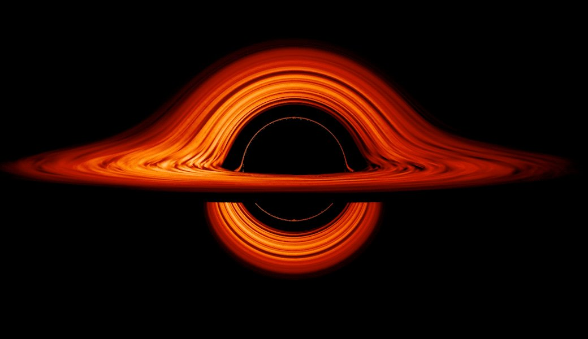
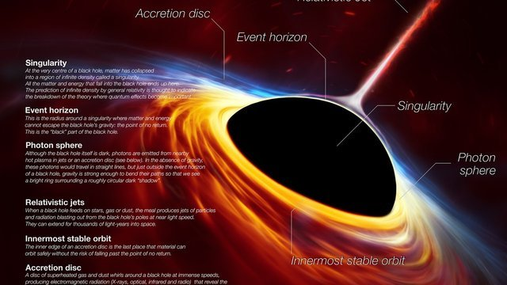
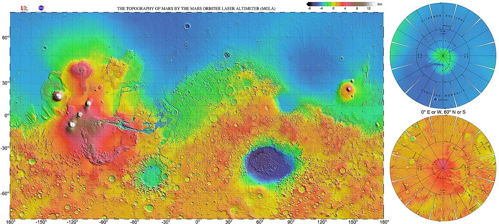
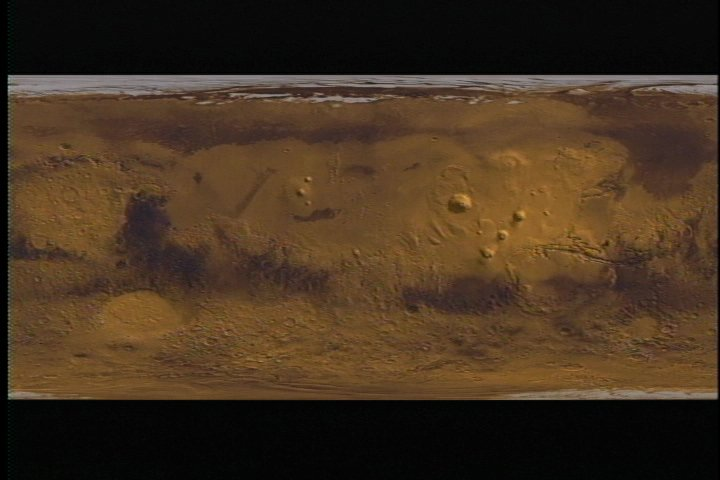
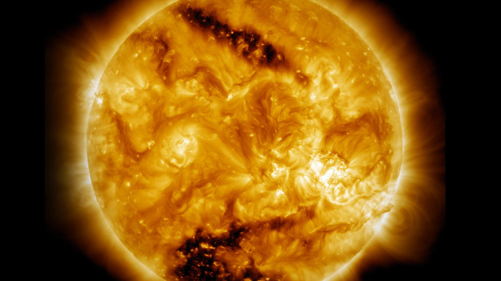

# References

Pictures given as references, and what they were used for.

## Black holes

Used for the traced black holes: the shadow, photon ring, lensed disc and jets (859f630 onwards).

## Mars

Used for Mars' heights and colour, baked by `tools/bake-mars.py` (7d47086).

## The Sun

Used for the Sun's surface, baked by `tools/bake-sun.py` (4af1bd3).
